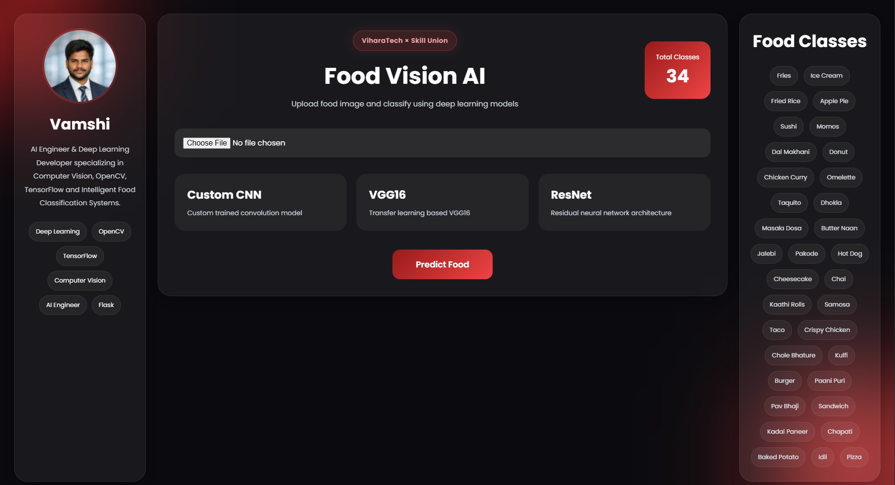
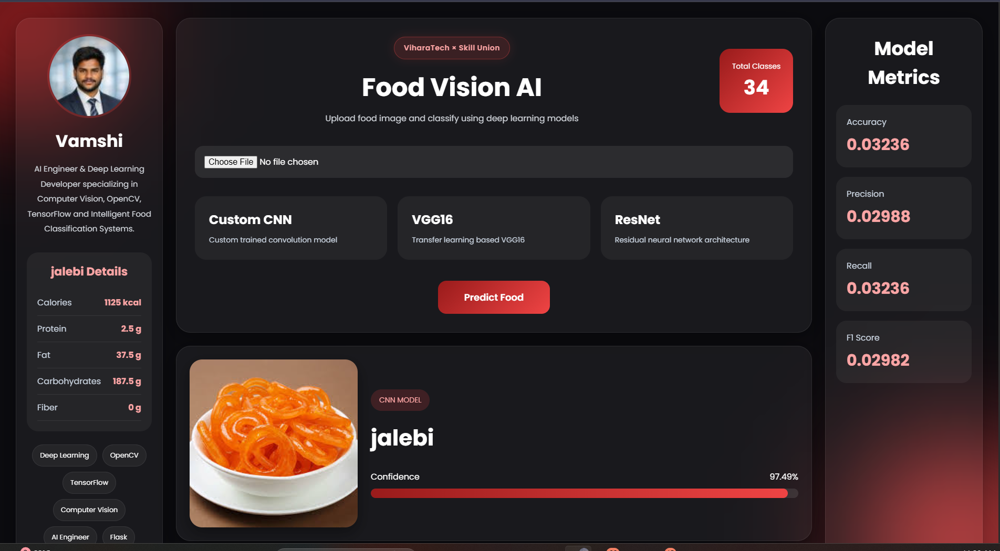

# 🍔 Food Vision AI

Food Vision AI is a Deep Learning-powered food classification and nutrition analysis system that predicts food categories from uploaded images using advanced CNN architectures.  
The application provides real-time food prediction, confidence score visualization, and nutrition details through an interactive modern web interface.

This project was built to explore practical applications of:
- Computer Vision
- Transfer Learning
- Deep Learning Model Deployment
- Flask Backend Development
- Redis Integration

---

## 🚀 Features

- Food image classification using AI
- Nutrition information display after prediction
- Deep Learning models:
  - Custom CNN
  - VGG16
  - ResNet50
- Real-time prediction confidence
- Redis-powered fast nutrition retrieval
- Modern responsive UI
- Upload and analyze food images instantly

---

## 🧠 Technologies Used

### Frontend
- HTML5
- CSS3
- JavaScript

### Backend
- Python
- Flask

### Deep Learning
- TensorFlow
- Keras
- OpenCV

### Database
- Redis

---

# 📦 Installation

## 1️⃣ Clone Repository

```bash
git clone https://github.com/your-username/food-vision-ai.git
cd food-vision-ai
```

---

## 2️⃣ Create Virtual Environment

### Windows

```bash
python -m venv .venv
```

Activate:

```bash
.venv\Scripts\activate
```

### Linux / Mac

```bash
python3 -m venv .venv
source .venv/bin/activate
```

---

## 3️⃣ Install Dependencies

```bash
pip install -r requirements.txt
```

---

# 🔥 Redis Setup

## Install Redis

### Windows
Download Redis:

https://github.com/microsoftarchive/redis/releases

### Linux

```bash
sudo apt install redis-server
```

### Mac

```bash
brew install redis
```

---

## Start Redis Server

### Windows

```bash
redis-server
```

### Linux / Mac

```bash
sudo service redis-server start
```

---

# 🤖 Download ResNet50 Model

Due to GitHub file size limitations, the trained ResNet50 model is hosted on Google Drive.

## Download Model

👉 https://drive.google.com/file/d/12eCgqD2To5Kq2XRIDGBb3OsNbA-MkWSd/view?usp=drive_link

After downloading:
- Place the model file inside the project directory
- Update the model path in the Flask application if required

---

# ▶️ Run Application

```bash
python app.py
```
---

# 🌐 Open in Browser

```bash
http://127.0.0.1:5000
```
# 📸 Application Preview

## 🔹 Before Prediction



The dashboard before prediction allows users to:
- Upload food images
- Select Deep Learning models
- View supported food classes
- Access model information and interface

---

## 🔹 After Prediction



After prediction, the system displays:
- Predicted food category
- Confidence score
- Nutrition details
- Food preview image
- Model metrics and analytics

---
---

# 📸 How It Works

1. Upload a food image  
2. AI model processes the image  
3. Food category gets predicted  
4. Nutrition details are fetched from Redis  
5. Confidence score and result are displayed on the dashboard  

---

# 🎯 Future Improvements

- Real-time webcam prediction
- Mobile application support
- Multi-food detection
- Calorie tracking system
- Voice assistant integration
- Cloud deployment

---

# 👨‍💻 Developer

**Vamshi Krishna**

AI Engineer & Deep Learning Developer specializing in:
- Computer Vision
- OpenCV
- TensorFlow
- Intelligent AI Systems

---

# ⭐ Support

If you found this project useful, consider giving it a ⭐ on GitHub.
